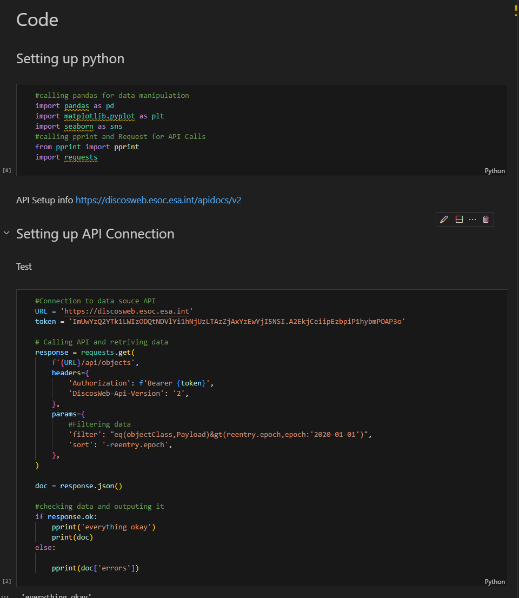
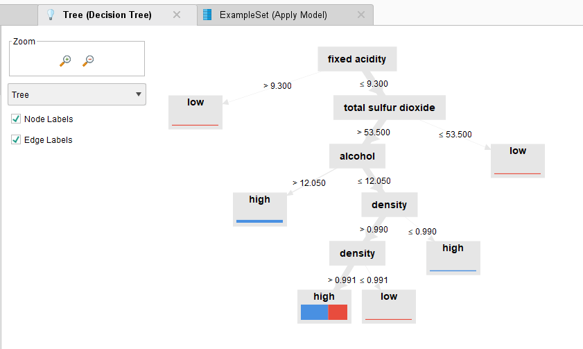

# Evolution 2
## Assessing Business Analytics
*By: Trevor Hofmann*

### What do you know?
My competencies, skills, and knowledge in terms of Business Analytics are the weakest of the four curriculum areas. I have been working full time in IT for right at 7 years now, since 2017 when I graduated with my bachelors in Business Administration Computer Information Systems for West Texas A&M. During my career I’ve had basically no form of Business Analytics experience. During my undergraduate I took a class around Tableau and data visualization. 
While working on my graduate degree I’ve taken two classes around Business Analytics, CIDM 5310 Business Intelligence and Decision Support Systems and CIDM 6308 Seminar in Data Analytics. I was better at the first over the second. In 5310 we worked on a project that utilized Business Intelligence to tell a story with data. This was done by coding with Python using Panda, Request API, matplotlib.pyplot, Seabrn, Pprint, and Jupiter notebooks. I had already reviewed Python in an earlier course so it was easy to jump back into. Over all my Python skills have increased more than any other. I had no Python experience when I started my graduate degree and ever since I have learned more Python than anything else. Here is an example of some of that code: 

 
For 6308 we primarily worked with Tableau and Rapid Minner to process data and design visualization so the data can be interpreted better. After the class I would have said Tableau was my better skill but after taking other classes I’ve gotten better at Rapid miner. Here is an example of one of those Rapid Miner visualization:

### Where are you are weak?
The competencies, skills, and knowledge where you feel you are the lest confident and proficient would center around data mining and visualization. Of the classes I’ve taken for Business Analytics, 6308 Seminar in Data Analytics I am weaker at compared to 5310 Business Intelligence and Decision Support Systems. I think this is caused by just how much more I’ve worked with Python over something like Rapid Miner. This especially applies to the skills I gained in 6308 specifically tableau is my weakest of all Business Analytics skills.
For 5310 I would say data visualization was the weakest skill I took away. Overall data visualization is something I struggled with. It didn’t feel to come as easy to me as other skills. It almost feels like it requires a level of being artistic that I do not have.

### The Future?
In the future I see myself using Business Intelligence and Decision Support Systems more and more. They enable someone to make effective decisions based on the data they have. At my current job we are already looking to implement BI solutions. We produce a large amount of data and being able to process it down to the good data and understand what it means will enable us to make effective business decisions. On top of this I would like to become a manager one day. Just knowing how to utilize or even know the questions to ask those developing they system will make a huge difference.
I’ve also already started using Python in general to script some repetitive tasks that I do. This to is going to come up more and more as automation becomes more necessary. 
