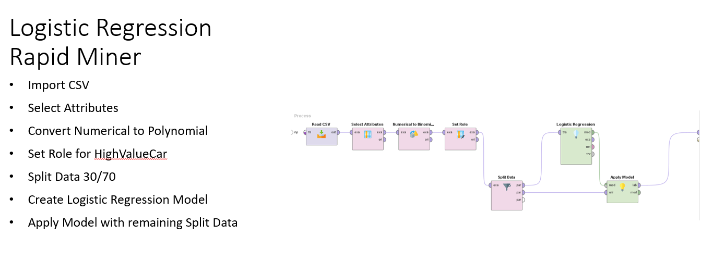
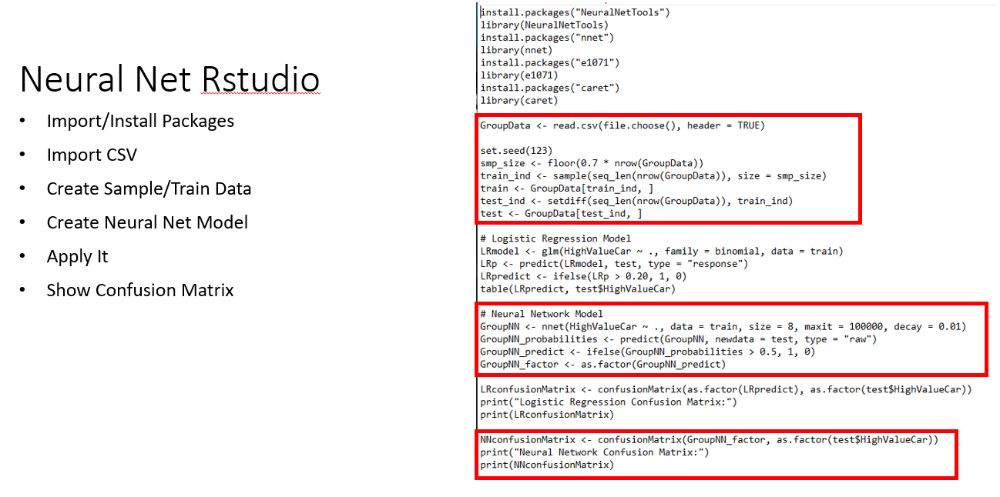
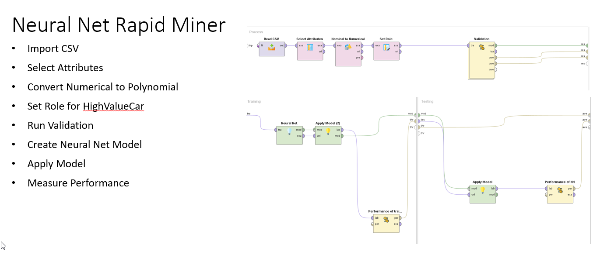
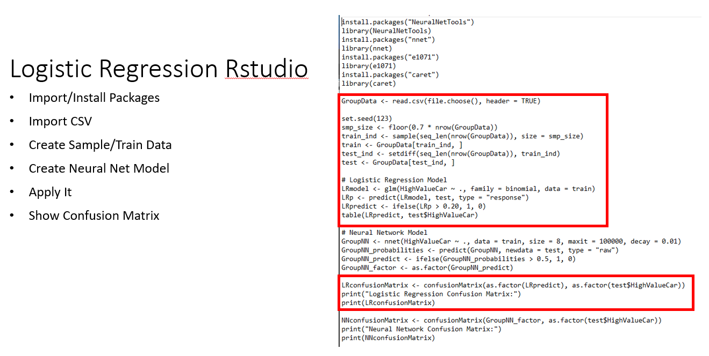
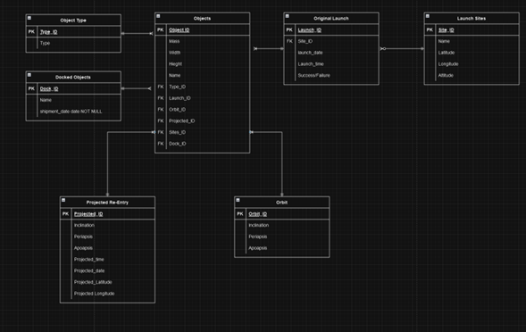
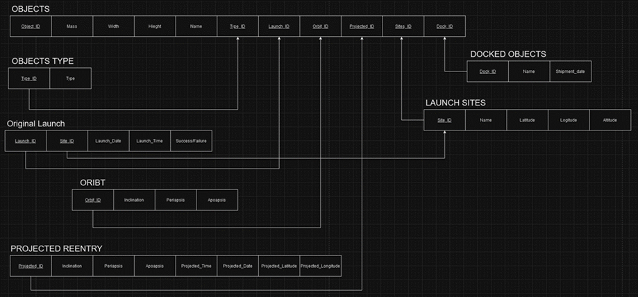
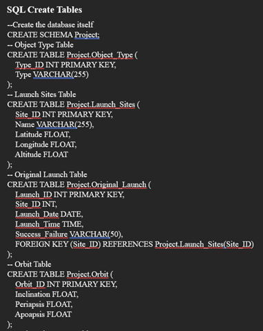

# Evolution 3
## Assessing Data Management
*By: Trevor Hofmann*

### What do you know?
My competencies, skills, and knowledge in terms of Data Management would rank third of the four curriculum areas. I have been working full time in IT for right at 7 years now, since 2017 when I graduated with my bachelors in Business Administration Computer Information Systems for West Texas A&M. During my career I’ve not worked with any kind of Data Mining or Management beyond Excel and some lite SQL. During my undergrade degree we did utilize Tableau to present data in one class but that was all I had used it for. I had taken classes that went over ERD diagrams, SQL, and business rules.
While working on my graduate degree I’ve taken two classes around Data Management, CIDM 6350 Data & Information Management and CIDM 6355 Data Mining Methods. For 6355 we performed a group project where we selected a data source and choose 4 data mining methods that we applied to the data utilizing Rapid Miner and RStudio. The four modes we choose where Decision Tree, Logistic Regression, Neural Net, and a Naïve Bayes. Me and one other group member specifically built the models in Rapid Miner and RStudio. Here are a couple screenshots of the models:
 

 

 
 
For 6350 Data & Information Management we did a project that focused on all the areas we had learned about that semester. This included creating business rules, EERD, relation diagrams in the 3rd normal form, and SQL code & queries. Here are some examples from the project:
### EERD

 
 
### Relational Diagram

 
 
### SQL Code 

 
 
 
### Where are you are weak?
I am more confident at data management and less confident in data mining as a whole. Since I’ve not worked on either of these areas in my career, they are both on the weaker end of my skills with data mining the lesser of the two. For the data management project, I took more time working on the relational diagram and business rules compared to the EERD and SQL code.
When it comes to data mining, we focused on using Rapid Miner and Rstudio. I found RStudio to be more difficult to jump in and learn especially in comparison to Rapid miner. During my project in 6355 it took me much longer to troubleshoot and create the Rstudio models. Of the models we worked on I felt like Naïve Bayes and Neural Net I struggled more compared to Decision Tree and Logistic Regression.

### The Future?
In my career I’ve found understanding how SQL works and data management in general has been helpful but far from necessary. This is normally caused by vendors being able to manage or support issues with any SQL databases there applications require. I do not see this changing in the near future. I do see it being helpful being able to understand how to best manage data.
When data management is paired with data mining it changes how I see the future. Being able to process large amounts of data through mining is going to be more and more prevalent, especially in a management role. A manager needs to be able to make effective decisions. I feel like that is stepping into data analytics though so I will discuss that more in that paper.

