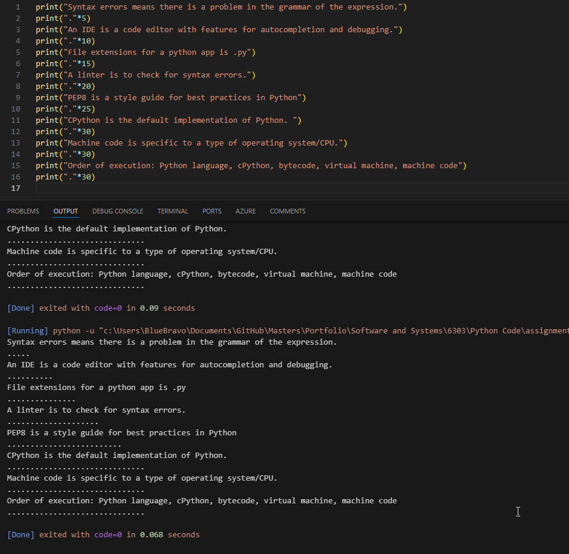
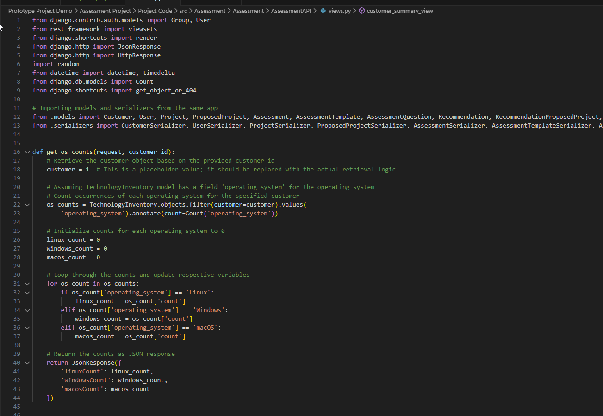
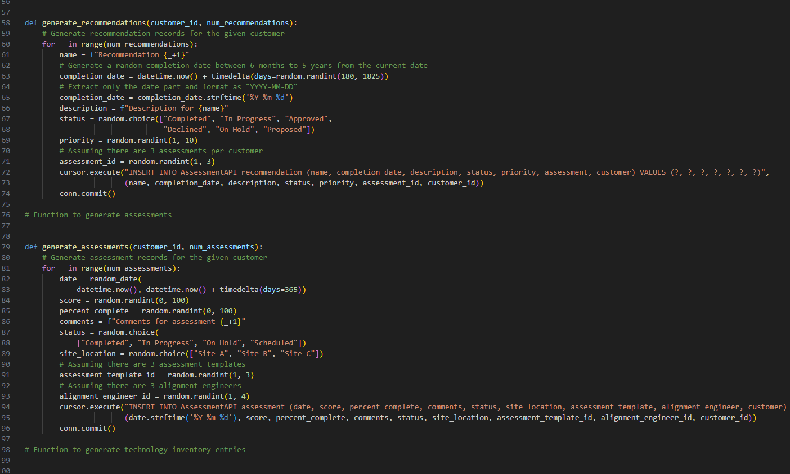
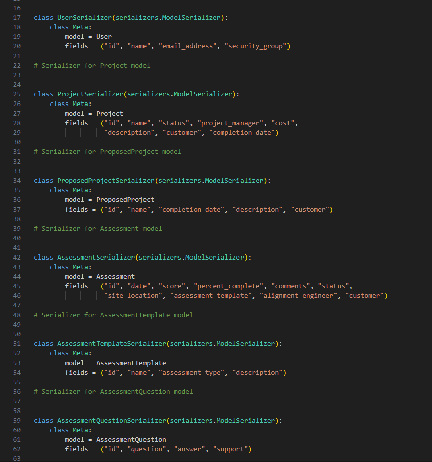

# Evolution 4
## Assessing Systems Development
*By: Trevor Hofmann*

### What do you know?
My competencies, skills, and knowledge in terms of Systems Development would be the second best set of skills. I have been working full time in IT for right at 7 years now, since 2017 when I graduated with my bachelors in Business Administration Computer Information Systems for West Texas A&M. During my career I’ve not worked with any kind of Systems Development like what I’ve learned at school. I’ve architected and engineered solutions and new implementations around servers, networks, and applications like Office 365. This difference is why I feel this is my second best skill while Network & Security is my First.
While working on my graduate degree I’ve taken two classes around Systems Development, CIDM 6330 Software Engineering/Systems Development and CIDM 6303 Technical Foundations of CIS. These classes have been very Python heavy. I had neve coded in Python before these classes even during my undergrade degree. From basic print statements to developing an application using Python. Here is my first Python code ever:

 
Though out my graduate degree I spent most of the time in Python even for course that where not Systems Development related. Here is an example of my most recent python code:

 
During this time the second skill I’ve gained is SQL. During my undergrade I had used SQL and now during my graduate degree. This like Python has been something I’ve not really used in my career. Most SQL work I do is installing it for a vendor, creating a user, or managing its backups. It is very uncommon that I have to run a query but even managing it has been made easier because I understand how it works. Here is an example of my most recent SQL work. It is a Python based SQL Script to generate data:

 
### Where are you are weak?
Django
Where I feel my competencies, skills, and knowledge that I am lest confident or proficient would center around Django as a whole. I’ve never used Django before my Graduate degree and I primarily only used it in CIDM-6330 which has been a recent course. My overall understanding of how it works fundamentally is much weaker than Python and SQL in general. This an example of my most Django code:

 
Compared to everything else I’ve learned that was centered around Systems Development I’ve just spent the least amount of time with Django. It is also Python based so by nature it caused me to become better a Python while learning about it.

### The Future?
For the future this one is difficult. I do not see myself becoming a database manager or a web developer. What I have received however is an understanding of who these systems work and an appreciation towards those who do it. I’ve just learned it is not for me. I feel like I will utilize my python skills well before I do SQL or Django. This is just caused by the power that is scripting.
Most of the scripting done during my career has been PowerShell based. I feel like this was something we missed out on during my Graduate degree. I understand it is more of a general degree, but I do feel like there were opportunities that scripting like this could have been learned in the program. I do continue to use PowerShell and will continue to utilize it in my career.
 
